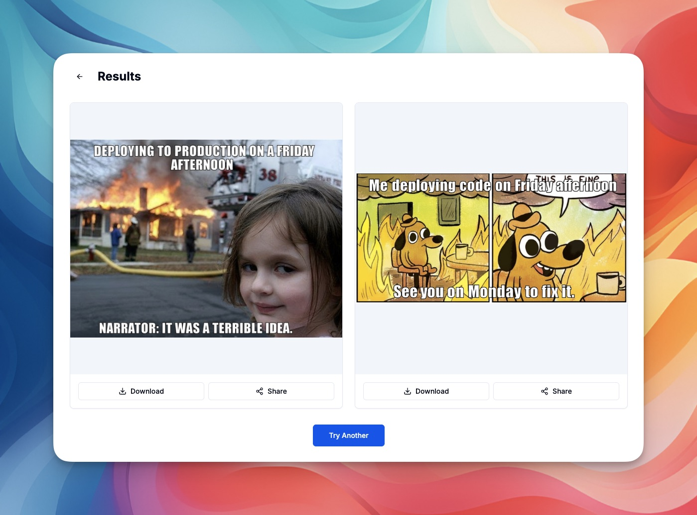

# MemeNano - AI First Meme Generator

MemeNano is an AI-powered web application that simplifies meme creation. Instead of searching for templates and thinking up captions yourself, simply describe your meme idea and let AI handle the rest - generating multiple humorous and relevant memes instantly.



## Features

- **AI-Powered Generation**: Describe your meme idea in plain text and get 4 unique memes
- **Automated Template Search**: AI automatically finds the most suitable meme templates
- **Smart Caption Creation**: AI generates contextually appropriate and funny captions
- **BYOK (Bring Your Own Key)**: Use your own Gemini API key for sustainability
- **Download & Share**: Easy downloading and sharing via Web Share API
- **Responsive Design**: Works seamlessly on desktop, tablet, and mobile devices
- **Accessible**: WCAG 2.1 AA compliant with keyboard navigation and screen reader support

## Tech Stack

### Frontend
- **Next.js 15** - React framework with App Router
- **React 19** - UI library
- **TypeScript** - Type safety
- **TailwindCSS** - Utility-first CSS framework
- **shadcn/ui** - Customizable UI components
- **Zustand** - Lightweight state management
- **Lucide React** - Icon library

### Backend
- **Next.js API Routes** - Serverless functions
- **Vercel** - Deployment platform with Edge Functions

### External APIs
- **Google Gemini API**
  - `gemini-2.0-flash-exp` - Prompt analysis and caption generation
  - `gemini-2.5-flash-image-preview` - Image generation and text overlay
- **Imgflip API** - Meme template database

## Getting Started

### Prerequisites

- Node.js 18+ and npm/pnpm/yarn
- A Google Gemini API key ([Get one here](https://aistudio.google.com/app/apikey))

### Installation

1. Clone the repository:
```bash
git clone https://github.com/yourusername/meme-nano-web.git
cd meme-nano-web
```

2. Install dependencies:
```bash
npm install
# or
pnpm install
# or
yarn install
```

3. Run the development server:
```bash
npm run dev
# or
pnpm dev
# or
yarn dev
```

4. Open [http://localhost:3000](http://localhost:3000) in your browser

### First Time Setup

1. Navigate to Settings (gear icon in top-right corner)
2. Paste your Gemini API key
3. Click "Save"
4. Return to home and start generating memes

## Environment Variables

This application doesn't require any environment variables on the server side since it uses a BYOK (Bring Your Own Key) model. Users provide their own Gemini API keys through the UI, which are stored securely in browser localStorage.

### Optional Configuration

If you want to add server-side API keys for demo purposes, create a `.env.local` file:

```env
# Optional: For server-side operations (not currently used)
GEMINI_API_KEY=your_gemini_api_key_here
```

## Deployment

### Quick Deploy to Vercel (Recommended)

The easiest way to deploy MemeNano:

```bash
# Install Vercel CLI
npm i -g vercel

# Deploy to production
vercel --prod
```

Or use the deploy button:

[](https://vercel.com/new/clone?repository-url=https://github.com/yourusername/meme-nano-web)

**[📖 Full Vercel Deployment Guide →](./docs/DEPLOYMENT_VERCEL.md)**

### Deploy to VPS with Docker

For self-hosting with complete control:

```bash
# Clone repository
git clone https://github.com/yourusername/meme-nano-web.git
cd meme-nano-web

# Start with Docker Compose
docker-compose up -d

# View logs
docker-compose logs -f
```

**[📖 Full VPS Deployment Guide →](./docs/DEPLOYMENT_VPS.md)**

### Other Deployment Options

MemeNano can be deployed to any platform that supports Next.js:

- **Netlify** - JAMstack platform
- **Railway** - Simplified cloud hosting
- **Render** - Modern cloud provider
- **AWS/GCP/Azure** - Enterprise cloud platforms

**[📖 All Deployment Options →](./docs/DEPLOYMENT.md)**

## Development Workflow

### Available Scripts

```bash
# Start development server
npm run dev

# Build for production
npm run build

# Start production server
npm run start

# Run linter
npm run lint

# Type check
npm run type-check

# Run tests
npm run test

# Run tests in watch mode
npm run test:watch

# Generate test coverage
npm run test:coverage
```

### Project Structure

```
meme-nano-web/
├── app/                    # Next.js app directory
│   ├── api/               # API routes
│   │   ├── analyze/       # Prompt analysis endpoint
│   │   ├── generate/      # Meme generation endpoint
│   │   └── templates/     # Template search endpoint
│   ├── home/              # Home page
│   ├── results/           # Results display page
│   ├── settings/          # Settings page
│   ├── layout.tsx         # Root layout
│   └── page.tsx           # Root page (redirects to /home)
├── components/            # React components
│   ├── home/             # Home page components
│   ├── layout/           # Layout components
│   ├── results/          # Results page components
│   ├── settings/         # Settings page components
│   └── ui/               # shadcn/ui components
├── lib/                  # Core utilities and logic
│   ├── api/             # API client functions
│   ├── config/          # Configuration and constants
│   ├── store/           # Zustand store
│   ├── types/           # TypeScript types
│   ├── utils/           # Utility functions
│   └── validators/      # Zod validation schemas
├── docs/                # Documentation
├── public/              # Static assets
└── __tests__/           # Test files
```

## API Key Setup Guide

### Getting a Gemini API Key

1. Visit [Google AI Studio](https://aistudio.google.com/app/apikey)
2. Sign in with your Google account
3. Click "Create API Key"
4. Copy the generated API key
5. Paste it into MemeNano Settings

### API Key Storage

- API keys are stored in browser localStorage
- Keys are encrypted at rest
- Keys are transmitted via HTTPS with Authorization headers
- Server never stores API keys permanently
- Keys are only used in-memory during request processing

## Deployment

### Deploy to Vercel (Recommended)

1. Push your code to GitHub
2. Import the project in [Vercel](https://vercel.com)
3. Deploy with default settings
4. Your app is live!

### Deploy to Other Platforms

MemeNano can be deployed to any platform that supports Next.js:

- **Netlify**: Use the Netlify adapter
- **AWS Amplify**: Follow AWS Next.js deployment guide
- **Self-hosted**: Use `npm run build` and `npm run start`

## Security Best Practices

1. **Never commit API keys** to version control
2. **Use HTTPS** for all communications (enforced by Vercel)
3. **Rate limiting** is implemented on all API endpoints
4. **Input validation** on both client and server
5. **API keys transmitted in headers**, never in URLs
6. **No logging of sensitive data**

## Troubleshooting

### "Invalid API Key" Error

- Verify your API key is correct
- Check if your API key has expired
- Ensure you have Gemini API access enabled
- Try regenerating your API key

### "Rate Limit Exceeded" Error

- Wait 60 seconds before trying again
- The app limits 5 requests per minute per IP

### Memes Not Generating

- Check your internet connection
- Verify API key is set in Settings
- Try with a more specific prompt
- Check browser console for errors

### Slow Generation

- Generation can take 10-15 seconds
- Depends on API response times
- Large images may take longer to process

## Contributing

Contributions are welcome! Please follow these guidelines:

1. Fork the repository
2. Create a feature branch (`git checkout -b feature/amazing-feature`)
3. Commit your changes (`git commit -m 'Add amazing feature'`)
4. Push to the branch (`git push origin feature/amazing-feature`)
5. Open a Pull Request

## License

This project is licensed under the MIT License - see the LICENSE file for details.

## Acknowledgments

- [Google Gemini](https://ai.google.dev/) for AI capabilities
- [Imgflip](https://imgflip.com/) for meme templates
- [shadcn/ui](https://ui.shadcn.com/) for beautiful components
- [Vercel](https://vercel.com/) for hosting and deployment